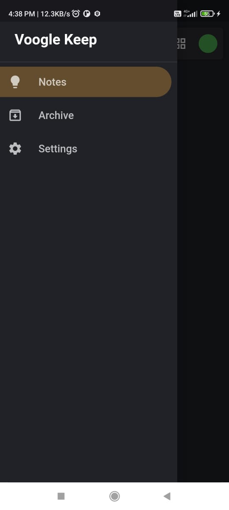
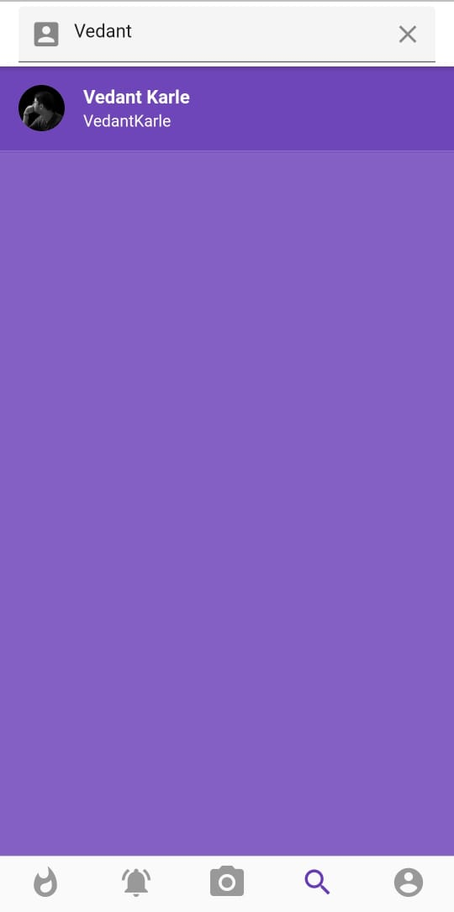

<h1 align="center">Hi 👋, I'm Vedant Prasad Priya Karle</h1>
<h3 align="center">Full Stack Web(MERN)/App(Flutter/React Native) Developer</h3>

  

- 🔭 I’m currently working on [Flutter Google Keep Clone](https://github.com/vedantkarle)

  
  
  
  

- 🌱 I’m currently learning **Everything**

- 👨‍💻 All of my projects are available at [https://vedantkarle.netlify.app/](https://vedantkarle.netlify.app/)

- 📫 How to reach me **karlevedant7@gmail.com**

- ⚡ Fun fact **I am a poet**

<h3 align="left">Connect with me:</h3>

<h3 align="left">Languages and Tools:</h3>

                      

